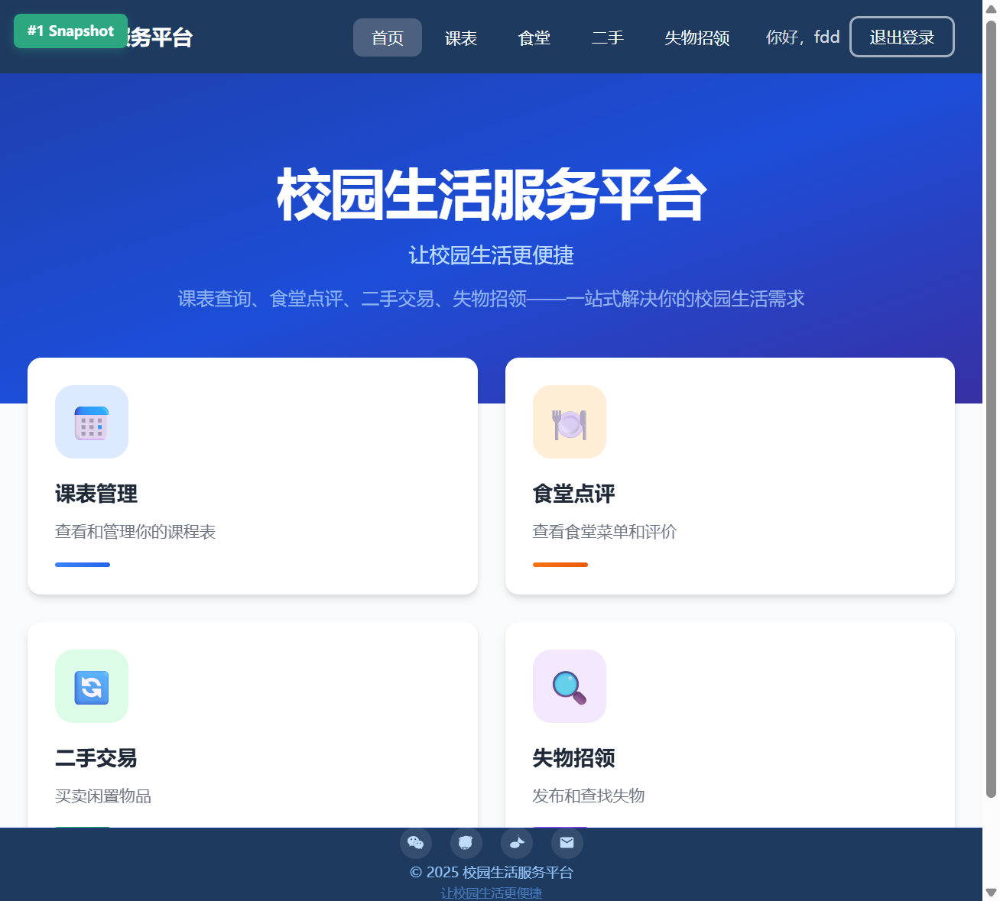
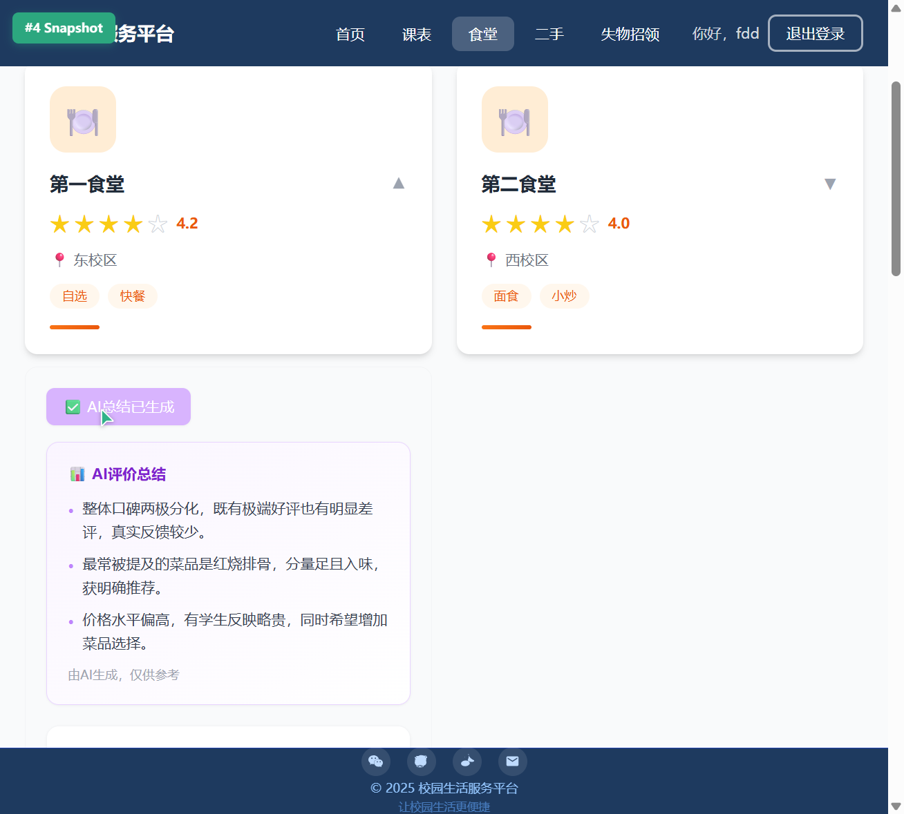
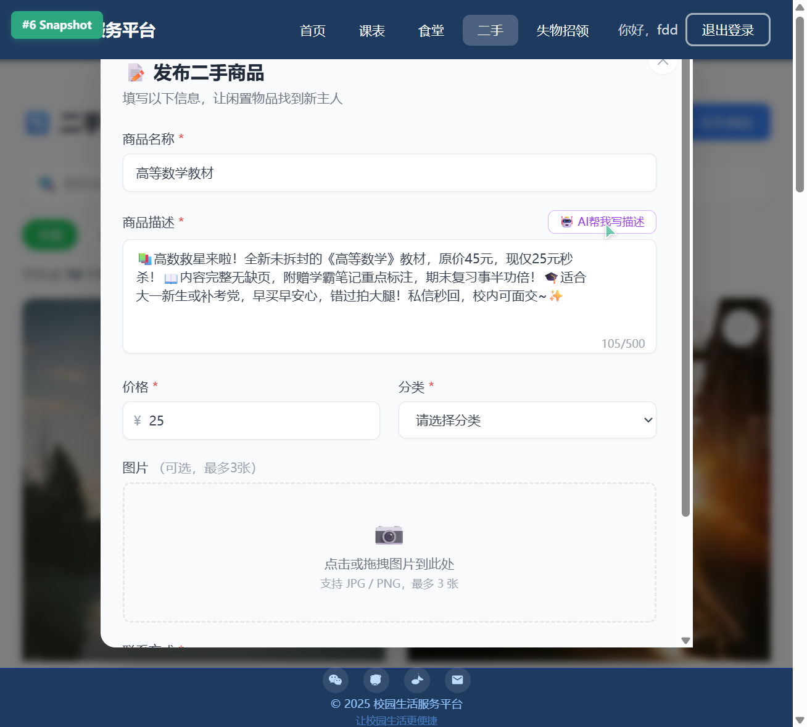
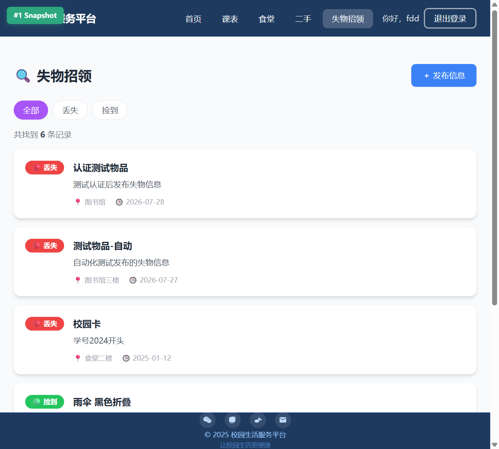
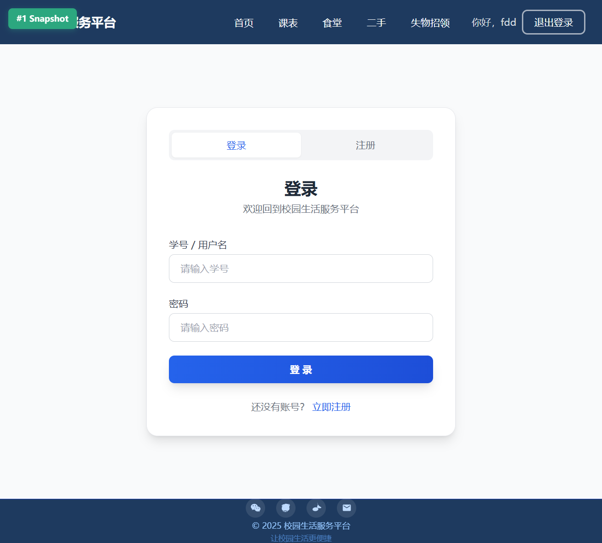
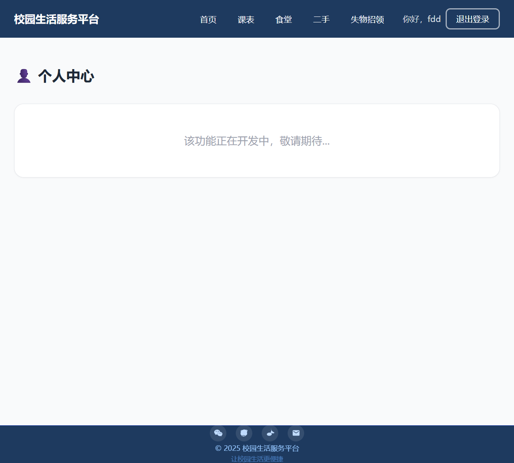

# 校园生活服务平台

> 让校园生活更便捷 —— 课表查询、食堂点评、二手交易、失物招领，一站式解决你的校园生活需求

## 项目简介

校园生活服务平台是一个面向大学生的综合性校园服务 Web 应用，集成了课表管理、食堂点评、二手交易、失物招领四大核心功能模块，并接入了 DeepSeek AI 大模型，为用户提供智能化的评价总结和商品描述生成服务。

## 功能列表

### 1. 首页导航
- 展示平台核心功能入口卡片
- 渐变色 Hero 区域，展示平台标语
- 快速跳转到各功能模块

### 2. 课表管理
- 查看每周课程安排
- 课程信息一目了然

### 3. 食堂点评
- 浏览各食堂菜单信息
- 对食堂进行评分和评价
- AI 智能总结食堂评价（基于 DeepSeek API）
- 查看其他用户的评价

### 4. 二手交易
- 发布闲置物品出售信息
- 浏览和搜索二手商品
- AI 智能生成商品描述（基于 DeepSeek API）
- 商品分类和筛选

### 5. 失物招领
- 发布失物/招领信息
- 查看和搜索失物招领列表
- 标记物品状态（丢失/找到）

### 6. 用户认证
- 用户注册和登录
- JWT Token 认证
- 密码加密存储（bcryptjs）


## 功能截图

| 首页导航 | 食堂点评 + AI总结 |
|:---:|:---:|
|  |  |

| 二手交易 + AI描述 | 失物招领 |
|:---:|:---:|
|  |  |

| 登录/注册 | 个人中心 |
|:---:|:---:|
|  |  |

### 截图说明

- **首页导航**：展示平台核心功能入口，渐变色 Hero 区域设计，快速跳转各功能模块
- **食堂点评 + AI总结**：浏览食堂信息、评分评价，点击"AI总结"按钮自动生成评价摘要
- **二手交易 + AI描述**：发布闲置物品，填写商品信息后点击"AI生成描述"自动生成文案
- **失物招领**：发布和搜索失物/招领信息，支持按类型筛选
- **登录/注册**：用户认证页面，支持注册和登录
- **个人中心**：展示用户信息和管理入口

---

## 技术栈

### 前端
- **React 18** - UI 框架
- **TypeScript** - 类型安全
- **Vite** - 构建工具和开发服务器
- **React Router DOM** - 路由管理
- **Tailwind CSS** - 原子化 CSS 框架

### 后端
- **Node.js** - 运行时环境
- **Express.js** - Web 框架
- **sql.js** - SQLite 数据库（纯 JavaScript 实现）
- **JWT (jsonwebtoken)** - 身份认证
- **bcryptjs** - 密码加密
- **CORS** - 跨域资源共享

### AI 服务
- **DeepSeek API** - 大语言模型，用于评价总结和商品描述生成

### 部署
- **Railway** - 全栈部署平台
- **Vercel** - 前端静态托管（可选）

## 项目结构

```
campus-life-platform/
├── public/                 # 静态资源
│   └── api/               # 模拟数据 JSON
├── server/                 # 后端服务
│   ├── database/          # 数据库连接和初始化
│   ├── middleware/        # 中间件（认证等）
│   ├── routes/            # API 路由
│   │   ├── ai.js          # AI 相关接口
│   │   ├── auth.js        # 用户认证接口
│   │   ├── canteens.js    # 食堂接口
│   │   ├── items.js       # 二手商品接口
│   │   ├── lost-found.js  # 失物招领接口
│   │   └── reviews.js     # 评价接口
│   └── index.js           # 服务器入口
├── src/                    # 前端源码
│   ├── components/        # 通用组件
│   ├── config/            # API 配置
│   ├── data/              # 模拟数据
│   ├── pages/             # 页面组件
│   ├── App.tsx            # 根组件
│   ├── main.tsx           # 入口文件
│   └── index.css          # 全局样式
├── index.html             # HTML 模板
├── package.json           # 依赖配置
├── vite.config.js         # Vite 配置
├── tailwind.config.js     # Tailwind 配置
├── railway.json           # Railway 部署配置
└── vercel.json            # Vercel 部署配置
```

## 部署链接

- **线上访问地址**: https://backend-production-48b3.up.railway.app
- **后端 API 地址**: https://backend-production-48b3.up.railway.app/api

## 本地运行方法

### 环境要求

- Node.js >= 18
- npm >= 9

### 安装依赖

```bash
cd campus-life-platform
npm install
```

### 配置环境变量

在项目根目录创建 `.env` 文件：

```
# DeepSeek API Key（用于 AI 功能）
DEEPSEEK_API_KEY=your_api_key_here

# 后端端口（默认 3001）
PORT=3001
```

### 启动开发服务器

```bash
# 启动前端开发服务器（端口 5181）
npm run dev

# 启动后端 API 服务器（端口 3001）
npm run server
```

前端访问地址：http://localhost:5181
后端 API 地址：http://localhost:3001

### 构建生产版本

```bash
npm run build
```

### 部署到 Railway

1. 在 Railway 创建新项目
2. 连接 GitHub 仓库
3. 设置环境变量（DEEPSEEK_API_KEY）
4. Railway 会自动构建和部署

## API 接口

| 方法 | 路径 | 描述 |
|------|------|------|
| GET | /api/canteens | 获取食堂列表 |
| GET | /api/canteens/:id | 获取食堂详情 |
| POST | /api/reviews | 提交评价 |
| GET | /api/reviews/:canteenId | 获取食堂评价 |
| POST | /api/ai/summarize-reviews | AI 总结食堂评价 |
| GET | /api/items | 获取二手商品列表 |
| POST | /api/items | 发布二手商品 |
| POST | /api/ai/generate-description | AI 生成商品描述 |
| GET | /api/lost-found | 获取失物招领列表 |
| POST | /api/lost-found | 发布失物招领信息 |
| POST | /api/auth/register | 用户注册 |
| POST | /api/auth/login | 用户登录 |

## License

MIT
